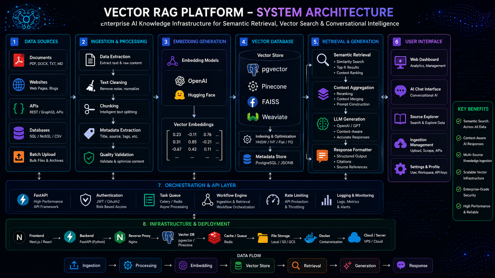
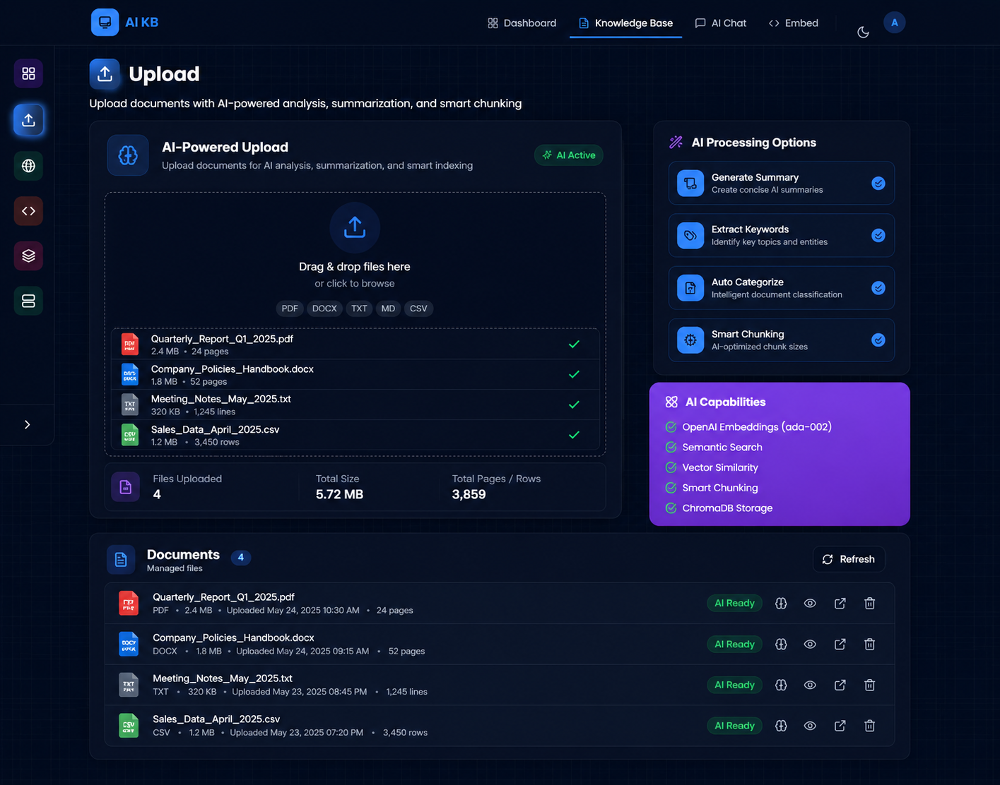
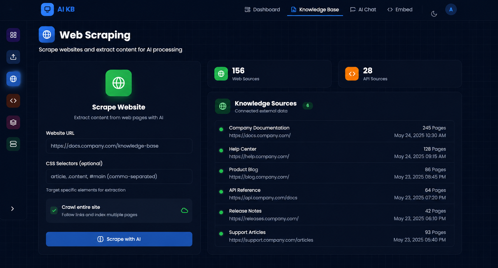
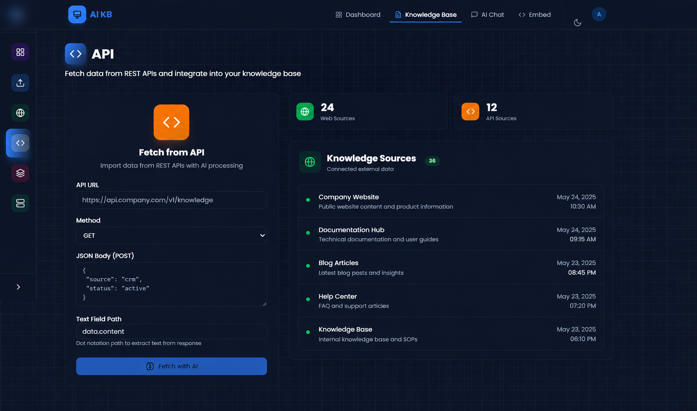
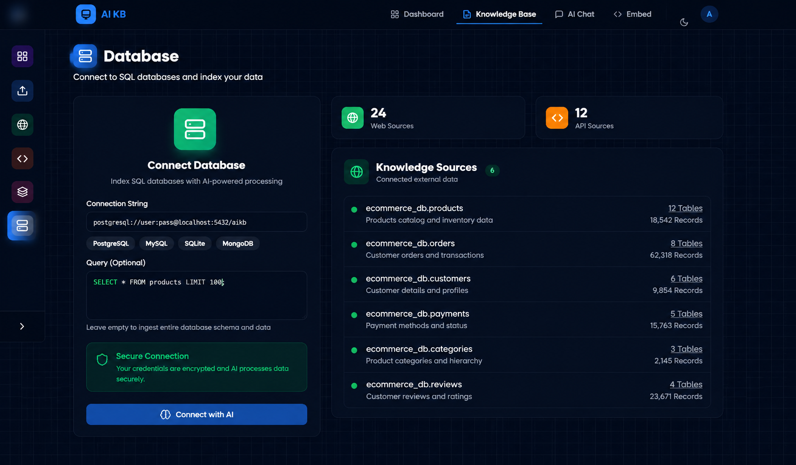
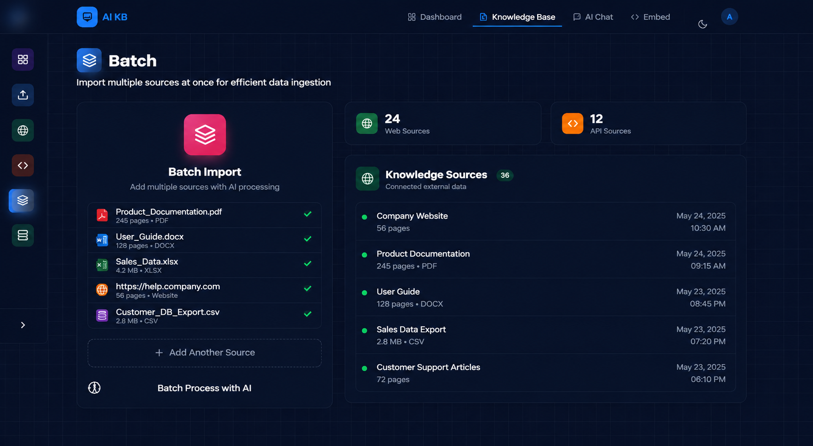

# Vector RAG Platform


Enterprise-grade Vector RAG platform engineered for semantic knowledge retrieval, AI-powered document intelligence, vector search infrastructure, and contextual conversational AI workflows.

---

<p align="center">
  
</p>

---

## Platform Vision
 
Vector RAG Platform is a modern AI knowledge infrastructure engineered to transform enterprise data into intelligent conversational experiences using semantic retrieval pipelines, vector embeddings, and Retrieval-Augmented Generation (RAG) workflows.

The platform centralizes document ingestion, vector indexing, contextual retrieval, and conversational AI interactions into a unified enterprise-grade knowledge ecosystem.

Designed with a scalable AI-first architecture, the system enables organizations to build intelligent knowledge assistants capable of understanding enterprise data across documents, APIs, websites, databases, and structured knowledge sources.

---

## Core Platform Capabilities

- Semantic knowledge retrieval
- Enterprise RAG infrastructure
- Vector similarity search
- Multi-source data ingestion
- AI-powered conversational workflows
- Intelligent document indexing
- Context-aware response generation
- Real-time embedding pipelines
- AI-assisted knowledge discovery
- Scalable retrieval infrastructure
- Enterprise dashboard ecosystem
- AI workflow orchestration

---

## Enterprise Features

| Capability | Description |
|---|---|
| Semantic Retrieval | Context-aware vector search |
| AI Conversations | Intelligent contextual responses |
| Multi-Source Ingestion | APIs, documents, websites, databases |
| Vector Infrastructure | pgvector, Pinecone, FAISS |
| Embedding Pipelines | OpenAI & HuggingFace |
| Dashboard Ecosystem | AI operational visibility |
| Workflow Automation | AI-powered ingestion orchestration |
| Source Citations | Traceable AI responses |

---

## AI Knowledge Infrastructure

### Semantic Retrieval Engine

The platform leverages advanced vector search infrastructure to retrieve highly relevant contextual information from enterprise knowledge repositories.

The retrieval pipeline includes:
- intelligent document chunking
- embedding generation workflows
- vector similarity matching
- contextual retrieval orchestration
- semantic ranking pipelines
- conversational context injection

This enables highly accurate and context-aware AI interactions across enterprise knowledge systems.

---

## Multi-Source Knowledge Ingestion

The platform supports intelligent ingestion pipelines across multiple structured and unstructured knowledge sources.

### Supported Knowledge Sources

- PDF & document ingestion
- Website scraping infrastructure
- REST API indexing
- Database vectorization workflows
- Batch ingestion pipelines
- Structured knowledge processing

The ingestion ecosystem transforms fragmented enterprise data into searchable semantic knowledge infrastructure.

---

## Vector Search Infrastructure

The platform integrates modern vector database infrastructure for scalable semantic retrieval and contextual knowledge discovery.

### Vector Infrastructure Stack

- PostgreSQL (pgvector)
- FAISS vector indexing
- Pinecone vector retrieval
- Weaviate semantic search
- Embedding orchestration pipelines
- Retrieval ranking infrastructure

---

## AI Infrastructure Stack

### AI & Retrieval Infrastructure

- LangChain
- LlamaIndex
- OpenAI Embeddings
- HuggingFace Embeddings
- Retrieval-Augmented Generation (RAG)
- Semantic Retrieval Pipelines

---

### Backend Engineering

- Python
- FastAPI
- Async Processing Pipelines
- REST API Infrastructure
- AI Workflow Orchestration

---

### Frontend Engineering

- React
- Next.js
- Tailwind CSS
- shadcn/ui
- Radix UI
- Framer Motion
- Lucide Icons

---

### Performance & Deployment

- Nginx
- Priority Hints
- Optimized Asset Delivery
- High-Performance Rendering
- Scalable AI Infrastructure

---

## Architecture Highlights

- Multi-source ingestion architecture
- Vector database abstraction
- Retrieval-Augmented Generation workflows
- Embedding orchestration pipelines
- Context-aware retrieval engine
- Modular AI infrastructure

---

## 🏗️ System Architecture

<p align="center">
  
</p>

Scalable AI knowledge infrastructure engineered for semantic retrieval, vector indexing, contextual reasoning, and enterprise-grade conversational AI workflows.

---

## Retrieval Pipeline

```txt
Data Sources
     │
     ▼
┌───────────────────────────┐
│ Multi-Source Ingestion    │
│ PDFs • APIs • Websites    │
│ Databases • Batch Files   │
└─────────────┬─────────────┘
              │
              ▼
┌───────────────────────────┐
│ Intelligent Processing    │
│ Chunking • Cleaning       │
│ Metadata Extraction       │
└─────────────┬─────────────┘
              │
              ▼
┌───────────────────────────┐
│ Embedding Generation      │
│ OpenAI • HuggingFace      │
└─────────────┬─────────────┘
              │
              ▼
┌───────────────────────────┐
│ Vector Infrastructure     │
│ pgvector • FAISS          │
│ Pinecone • Weaviate       │
└─────────────┬─────────────┘
              │
              ▼
┌───────────────────────────┐
│ Semantic Retrieval Engine │
│ Similarity Search         │
│ Context Ranking           │
└─────────────┬─────────────┘
              │
              ▼
┌───────────────────────────┐
│ Conversational AI Layer   │
│ Context-Aware Responses   │
│ Intelligent Interactions  │
└───────────────────────────┘
```

---

# 🌐 Platform Preview

Enterprise AI knowledge infrastructure designed for semantic retrieval, contextual AI workflows, and scalable vector search operations.

---

## 📊 Platform Overview Dashboard

<p align="center">
  
</p>

Centralized AI operations dashboard providing visibility into ingestion workflows, vector infrastructure, embedding pipelines, and semantic retrieval orchestration.

---

## 📂 Intelligent Document Ingestion

<p align="center">
  
</p>

Advanced ingestion infrastructure engineered for intelligent document processing, semantic chunking, embedding generation, and AI-ready knowledge indexing.

---

## 🤖 Conversational AI Interface

<p align="center">
  
</p>

Context-aware conversational AI system powered by semantic retrieval pipelines, vector similarity search, and enterprise knowledge orchestration.

---

## 🧠 AI Assistant Workspace

<p align="center">
  
</p>

Unified AI interaction workspace designed for intelligent enterprise conversations, contextual retrieval workflows, and AI-assisted knowledge discovery.

---

## 🌐 Website Scraping Infrastructure

<p align="center">
  
</p>

Enterprise web ingestion pipelines enabling automated website indexing, semantic extraction, and contextual knowledge synchronization.

---

## 🔌 API Integration Infrastructure

<p align="center">
  
</p>

Scalable API ingestion architecture for integrating structured enterprise systems into unified vector retrieval infrastructure.

---

## 🗄️ Database Vectorization System

<p align="center">
  
</p>

Structured database indexing workflows engineered for semantic retrieval, intelligent querying, and vectorized enterprise data processing.

---

## ⚡ Batch Processing Workflows

<p align="center">
  
</p>

High-performance batch ingestion pipelines optimized for scalable embedding generation, indexing orchestration, and large-scale knowledge processing.

---

## Business Problem

Traditional enterprise knowledge systems are fragmented across documents, APIs, databases, and external platforms, making contextual information retrieval inefficient and difficult to scale.

Organizations often struggle with:
- disconnected knowledge repositories
- slow information discovery
- poor semantic search capabilities
- inefficient support workflows
- inconsistent knowledge accessibility
- limited contextual understanding
- unstructured enterprise data
- manual information retrieval processes

Conventional keyword-based search systems fail to understand semantic intent, resulting in inaccurate retrieval and poor conversational AI experiences.

Modern enterprises require intelligent retrieval infrastructure capable of transforming distributed knowledge into contextual AI interactions.

---

## Key Use Cases

- Enterprise knowledge assistants
- Customer support copilots
- Internal documentation search
- AI-powered help centers
- Research and compliance retrieval
- Multi-source knowledge discovery
- Organizational knowledge management

---

## Solution

Vector RAG Platform centralizes enterprise knowledge retrieval into a unified semantic AI infrastructure powered by vector embeddings, contextual retrieval pipelines, and Retrieval-Augmented Generation workflows.

The platform enables:
- semantic document understanding
- contextual conversational AI
- intelligent vector retrieval
- multi-source knowledge ingestion
- AI-assisted knowledge discovery
- scalable embedding orchestration
- real-time semantic search
- enterprise AI knowledge workflows

The ecosystem is engineered to deliver highly accurate contextual responses while maintaining scalable retrieval performance across enterprise-scale knowledge systems.

---

## Enterprise Platform Features

### AI Knowledge Intelligence

- Semantic knowledge retrieval
- Context-aware AI responses
- Conversational AI workflows
- Intelligent document understanding
- AI-assisted knowledge discovery
- Dynamic contextual retrieval

---

### Vector Search Infrastructure

- High-performance vector indexing
- Similarity search orchestration
- Embedding lifecycle management
- Semantic ranking pipelines
- Vector database abstraction
- Retrieval optimization workflows

---

### Enterprise Data Ingestion

- Multi-source ingestion architecture
- Document indexing pipelines
- Website knowledge extraction
- API ingestion workflows
- Database synchronization pipelines
- Batch processing infrastructure

---

### Platform Engineering

- Modular AI architecture
- Scalable retrieval infrastructure
- High-performance processing pipelines
- Enterprise-grade dashboard ecosystem
- Optimized frontend rendering
- AI workflow orchestration

---

## Developer Experience

The platform is engineered with a modular AI-first architecture designed for scalability, maintainability, and enterprise development workflows.

### Developer Infrastructure

- Modular frontend architecture
- Reusable UI component system
- Scalable API architecture
- Type-safe development workflows
- Centralized AI processing pipelines
- Configurable retrieval infrastructure
- Reusable semantic retrieval modules
- Organized vector orchestration layers

---

## Architecture Principles

- AI-first system design
- Scalable vector infrastructure
- Modular retrieval orchestration
- Enterprise knowledge isolation
- Context-aware AI workflows
- High-performance ingestion pipelines
- Reusable AI infrastructure layers
- Semantic retrieval optimization
- Distributed processing architecture

---

## Security Architecture

- Secure API infrastructure
- Protected knowledge ingestion workflows
- Environment-based configuration management
- Secure vector retrieval pipelines
- Role-based access control (RBAC)
- Protected enterprise processing workflows

---

## Scalability Engineering

The platform is engineered for scalable enterprise AI workloads and high-performance semantic retrieval operations.

### Scalability Features

- Distributed retrieval workflows
- Optimized embedding pipelines
- High-performance vector search
- Async ingestion processing
- Scalable indexing orchestration
- Modular AI infrastructure
- Enterprise-grade rendering optimization
- Intelligent asset delivery

---

## Performance Optimization

- Optimized semantic retrieval
- Intelligent vector indexing
- Async processing pipelines
- Efficient embedding orchestration
- Optimized frontend rendering
- High-performance API infrastructure
- Scalable conversational workflows
- Retrieval latency optimization

---

## Product Roadmap

### Phase 1 — Knowledge Infrastructure
- Multi-source ingestion pipelines
- Vector database infrastructure
- Semantic retrieval engine
- Conversational AI foundation

---

### Phase 2 — Enterprise AI Workflows
- Advanced contextual retrieval
- AI workflow orchestration
- Multi-model embedding pipelines
- Enterprise dashboard ecosystem
- Knowledge synchronization workflows

---

### Phase 3 — Scalable AI Infrastructure
- Distributed retrieval pipelines
- Multi-tenant AI infrastructure
- Enterprise AI automation
- Real-time semantic processing
- Advanced vector orchestration

---

### Phase 4 — Intelligent Knowledge Ecosystem
- Predictive knowledge intelligence
- Autonomous retrieval optimization
- AI-generated enterprise insights
- Intelligent workflow automation
- Advanced contextual reasoning systems

---

## Repository Structure

```txt
/assets
   /banner
   /screenshots
   /architecture
   /workflow-diagrams
```

---

## Live Platform

🌐 Live Demo: https://rag.shivamitcs.in/

---

## Repository Topics

```txt
rag-platform
vector-search
semantic-search
enterprise-rag
knowledge-assistant
retrieval-augmented-generation
pgvector
langchain
llamaindex
fastapi
nextjs
ai-search
document-intelligence
knowledge-management
conversational-ai
```

---

## Engineering Vision

Vector RAG Platform represents a modern enterprise AI knowledge infrastructure engineered for semantic retrieval, contextual intelligence, and scalable conversational AI workflows.

The system is designed to transform fragmented enterprise data into intelligent AI-powered knowledge experiences through scalable vector infrastructure, retrieval orchestration, and AI-assisted interaction pipelines.

---

## License

MIT License

Copyright © 2026 SHIVAM ITCS
